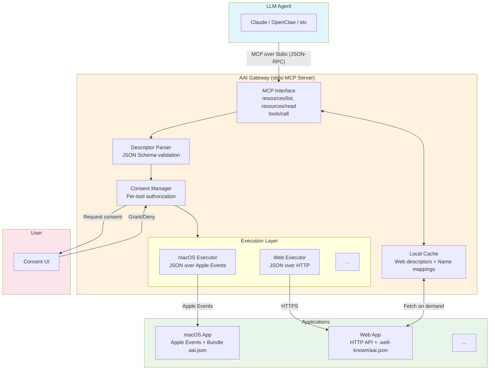

# System Architecture

## Architecture Overview



## Core Design Principles

### 1. Abstract Descriptor

`aai.json` is a **platform-agnostic descriptor** that defines capabilities using JSON Schema. See [aai.json Descriptor](./aai-json.md).

### 2. Two-Layer Authorization

Both layers authorize agent to access app, but protect different parties:

| Layer | Initiated By | Protects Against |
|-------|--------------|-----------------|
| **Gateway Consent** | Gateway | Malicious apps exposing dangerous tools |
| **App Authorization** | App or OS | Agent accessing app data without user knowledge |

See [Security Model](./security.md) for details.

### 3. Pluggable Executors

Gateway uses platform-specific executors:

| Platform | Transport | App Authorization |
|----------|-----------|-------------------|
| macOS | JSON over Apple Events | Operating System |
| web | JSON over HTTPS | OAuth 2.1 |
| linux | JSON over IPC (TBD) | Operating System |
| windows | JSON over IPC (TBD) | Operating System |

### 4. Zero-Install Gateway

Gateway runs as a stdio MCP server — no daemon, no background service. It is spawned by the agent client (e.g. Claude Desktop) when needed.

## Data Flow

```
Desktop apps:
1. Gateway startup     → scans /Applications for Bundle aai.json files
2. Agent → resources/list    → Gateway returns discovered desktop apps
3. Agent → resources/read    → Gateway returns app descriptor
4. Agent → tools/call        → Gateway checks consent → Apple Events → returns result

Web apps:
1. Agent → resources/read("https://notion.so")
           → Gateway fetches notion.so/.well-known/aai.json (cached locally)
           → returns descriptor
2. Agent → tools/call        → Gateway checks consent → OAuth → HTTPS → returns result
```

## Separation of Concerns

| Layer | Concern |
|-------|---------|
| **aai.json** | What the app can do (abstract, platform-agnostic) |
| **Gateway** | Discovery + User consent + How to call (platform-specific) |
| **App** | Execute the operation |

---

[Back to Spec Index](./README.md)
