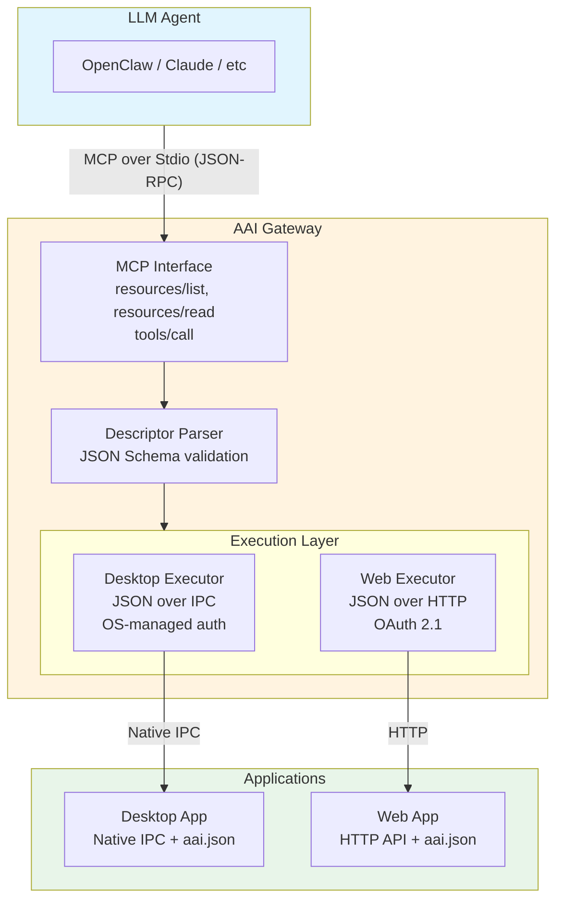

# System Architecture

## Architecture Overview



## Core Design Principles

### 1. Abstract Descriptor

`aai.json` is a **platform-agnostic descriptor** that defines capabilities using JSON Schema. See [aai.json Descriptor](./aai-json.md).

### 2. Gateway Translates to Platform Execution

| Platform | Transport | Authorization |
|----------|-----------|---------------|
| Desktop | JSON over native IPC | Operating System |
| Web | JSON over HTTP | Gateway (OAuth 2.1) |

### 3. Progressive Discovery

Agents load tool definitions on-demand via MCP resources, avoiding context explosion.

## Data Flow

```
1. Agent → resources/list    → Gateway returns available apps
2. Agent → resources/read    → Gateway returns app descriptor
3. Agent → tools/call        → Gateway validates, executes, returns result
```

## Separation of Concerns

| Layer | Concern |
|-------|---------|
| **aai.json** | What the app can do (abstract) |
| **Gateway** | How to call it (platform-specific) |
| **App** | Execute the operation |

---

[Back to Spec Index](./README.md)
