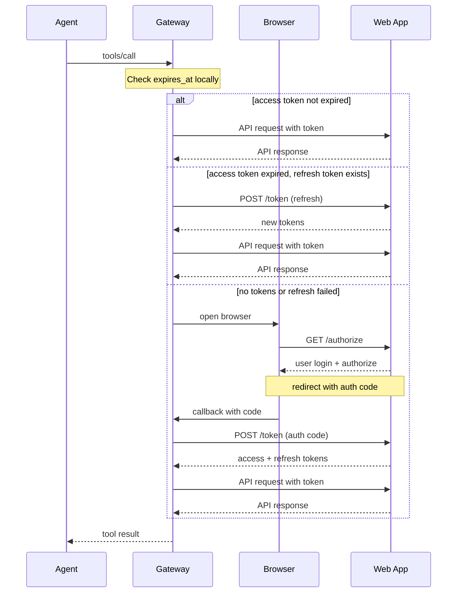

# Security Model

## Authorization by Platform Type

| Platform | Authorization Handler |
|----------|----------------------|
| Desktop App | Operating System |
| Web App | Web App (via OAuth 2.1) |

## Desktop App Authorization

Desktop apps rely on the operating system's native authorization. Gateway does not participate.

1. Gateway sends request via native IPC
2. OS prompts user (first time only)
3. User approves/denies
4. OS enforces the decision

## Web App Authorization

Web apps handle authorization via OAuth 2.1. Gateway manages tokens but does not make authorization decisions—that's the Web App's responsibility.

### Authorization Flow

Gateway checks token validity locally using `expires_at` timestamp—no API call needed.



### Authorization Endpoint

**Request** (browser redirect):

| Parameter | Type | Description |
|-----------|------|-------------|
| `response_type` | string | `code` |
| `client_id` | string | Client identifier |
| `redirect_uri` | string | Callback URL |
| `scope` | string | Space-separated scopes |
| `state` | string | CSRF token |
| `code_challenge` | string | PKCE challenge |
| `code_challenge_method` | string | `S256` |

**Response** (redirect):

| Parameter | Type | Description |
|-----------|------|-------------|
| `code` | string | Authorization code |
| `state` | string | Must match request |

### Token Endpoint

**Request (authorization code)**:

```http
POST /oauth/token
Content-Type: application/x-www-form-urlencoded

grant_type=authorization_code&
code=<code>&
redirect_uri=<uri>&
code_verifier=<verifier>
```

**Request (refresh token)**:

```http
POST /oauth/token
Content-Type: application/x-www-form-urlencoded

grant_type=refresh_token&
refresh_token=<refresh_token>
```

**Response**:

```json
{
  "access_token": "eyJhbG...",
  "token_type": "Bearer",
  "expires_in": 3600,
  "refresh_token": "dGhpcyBpcy...",
  "scope": "read write"
}
```

| Field | Type | Description |
|-------|------|-------------|
| `access_token` | string | Token for API calls |
| `token_type` | string | `Bearer` |
| `expires_in` | number | Token lifetime in seconds |
| `refresh_token` | string | Token for refresh |

### Token Storage

```
~/.aai/tokens/<app_id>.json
```

```json
{
  "access_token": "...",
  "refresh_token": "...",
  "expires_at": 1700000000,
  "token_type": "Bearer"
}
```

### Token Lifetime Recommendations

| Token Type | Recommended |
|------------|-------------|
| Access Token | 1 hour |
| Refresh Token | 7 days |

---

[Back to Spec Index](./README.md)
