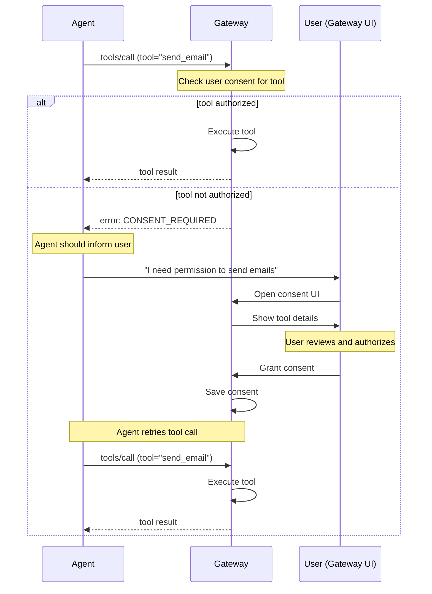
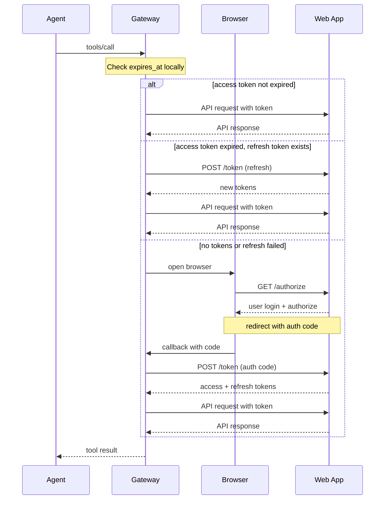

# Security Model

## Overview

AAI Gateway implements a **two-layer authorization model**:

| Layer | Purpose | Handler | Applies To |
|-------|---------|---------|------------|
| **User Consent** | User authorizes which tools the agent can use | Gateway | ALL platforms |
| **App Authorization** | User authorizes app to access their data | App or OS | Per platform |

**User Consent is required for ALL platforms** (macOS, web, linux, windows) to protect users from malicious apps exposing dangerous tools.

## Why User Consent?

Without Gateway-level consent:
- Malicious web app could expose `delete_all_files` tool
- Agent would call it without user awareness
- User's data destroyed

With Gateway-level consent:
- Gateway shows: "App X wants to expose tool: `delete_all_files`"
- Description: "Delete all files in user's home directory"
- Parameters: `{ path: string }`
- User must explicitly authorize before agent can call

## User Consent Flow



### Consent Required Error

When agent calls an unauthorized tool:

```json
{
  "error": {
    "code": "CONSENT_REQUIRED",
    "message": "User consent required for tool",
    "data": {
      "app_id": "com.example.mail",
      "app_name": "Example Mail",
      "tool": "send_email",
      "tool_description": "Send an email on behalf of the user",
      "tool_parameters": {
        "to": { "type": "array", "items": { "type": "string" }, "description": "Recipient email addresses" },
        "subject": { "type": "string", "description": "Email subject line" },
        "body": { "type": "string", "description": "Email body content" }
      },
      "consent_url": "aai://consent?app=com.example.mail&tool=send_email"
    }
  }
}
```

Agent should present this information to user and guide them to authorize.

## Consent UI Requirements

Gateway MUST display the following information:

### Required Information

| Field | Source | Description |
|-------|--------|-------------|
| App Name | `app.name` | Which app is exposing this tool |
| App ID | `app.id` | Unique identifier |
| Tool Name | `tool.name` | Tool identifier |
| Tool Description | `tool.description` | What the tool does |
| Parameters | `tool.parameters` | What data agent can pass to tool |
| Returns | `tool.returns` | What data tool returns (if sensitive) |

### UI Example

```
┌─────────────────────────────────────────────────────────────┐
│ ⚠️  Tool Authorization Request                              │
├─────────────────────────────────────────────────────────────┤
│                                                             │
│ App: Example Mail (com.example.mail)                        │
│                                                             │
│ Agent requests permission to use:                           │
│                                                             │
│ ┌─────────────────────────────────────────────────────────┐ │
│ │ send_email                                              │ │
│ │                                                         │ │
│ │ Send an email on behalf of the user                     │ │
│ │                                                         │ │
│ │ Parameters:                                             │ │
│ │ • to: Recipient email addresses                         │ │
│ │ • subject: Email subject line                           │ │
│ │ • body: Email body content                              │ │
│ │                                                         │ │
│ │ ⚠️ Agent can send emails to anyone with any content     │ │
│ └─────────────────────────────────────────────────────────┘ │
│                                                             │
│ [Authorize Tool]  [Authorize All Tools]  [Deny]             │
│                                                             │
│ ☐ Remember this decision                                   │
│                                                             │
└─────────────────────────────────────────────────────────────┘
```

### User Choices

| Option | Behavior |
|--------|----------|
| **Authorize Tool** | Grant access to this specific tool only |
| **Authorize All Tools** | Grant access to all tools from this app |
| **Deny** | Reject access, agent cannot use this tool |
| **Remember** | Persist decision, don't ask again for this tool |

## Consent Storage

Gateway stores user consent decisions:

```
~/.aai/consent.json
```

```json
{
  "consents": {
    "com.example.mail": {
      "all_tools": false,
      "tools": {
        "send_email": {
          "granted": true,
          "granted_at": "2026-02-19T10:00:00Z",
          "remember": true
        },
        "delete_email": {
          "granted": false,
          "granted_at": "2026-02-19T10:00:00Z",
          "remember": true
        }
      }
    },
    "com.example.calendar": {
      "all_tools": true,
      "granted_at": "2026-02-19T10:00:00Z"
    }
  }
}
```

### Storage Fields

| Field | Type | Description |
|-------|------|-------------|
| `all_tools` | boolean | User authorized all tools from this app |
| `tools.<name>.granted` | boolean | Whether this tool is authorized |
| `tools.<name>.granted_at` | string | When consent was granted |
| `tools.<name>.remember` | boolean | Persist decision |

## Platform-Specific Authorization

After Gateway-level consent, platform-specific authorization applies:

### Desktop (macOS)

| Aspect | Handler |
|--------|---------|
| User Consent | Gateway (per-tool) |
| App Authorization | Operating System |

macOS prompts user when Gateway first calls the app via Apple Events. User approves once, OS remembers.

### Web

| Aspect | Handler |
|--------|---------|
| User Consent | Gateway (per-tool) |
| App Authorization | Web App (OAuth 2.1) |

After user consents at Gateway level, Gateway obtains OAuth token from Web App.

### Authorization Flow (OAuth 2.1)

Gateway checks token validity locally using `expires_at` timestamp—no API call needed.



### Authorization Endpoint

**Request** (browser redirect):

| Parameter | Type | Description |
|-----------|------|-------------|
| `response_type` | string | `code` |
| `client_id` | string | Client identifier |
| `redirect_uri` | string | Callback URL |
| `scope` | string | Space-separated scopes |
| `state` | string | CSRF token |
| `code_challenge` | string | PKCE challenge |
| `code_challenge_method` | string | `S256` |

**Response** (redirect):

| Parameter | Type | Description |
|-----------|------|-------------|
| `code` | string | Authorization code |
| `state` | string | Must match request |

### Token Endpoint

**Request (authorization code)**:

```http
POST /oauth/token
Content-Type: application/x-www-form-urlencoded

grant_type=authorization_code&
code=<code>&
redirect_uri=<uri>&
code_verifier=<verifier>
```

**Request (refresh token)**:

```http
POST /oauth/token
Content-Type: application/x-www-form-urlencoded

grant_type=refresh_token&
refresh_token=<refresh_token>
```

**Response**:

```json
{
  "access_token": "eyJhbG...",
  "token_type": "Bearer",
  "expires_in": 3600,
  "refresh_token": "dGhpcyBpcy...",
  "scope": "read write"
}
```

| Field | Type | Description |
|-------|------|-------------|
| `access_token` | string | Token for API calls |
| `token_type` | string | `Bearer` |
| `expires_in` | number | Token lifetime in seconds |
| `refresh_token` | string | Token for refresh |

### Token Storage

```
~/.aai/tokens/<app_id>.json
```

```json
{
  "access_token": "...",
  "refresh_token": "...",
  "expires_at": 1700000000,
  "token_type": "Bearer"
}
```

### Token Lifetime Recommendations

| Token Type | Recommended |
|------------|-------------|
| Access Token | 1 hour |
| Refresh Token | 7 days |

---

[Back to Spec Index](./README.md)
