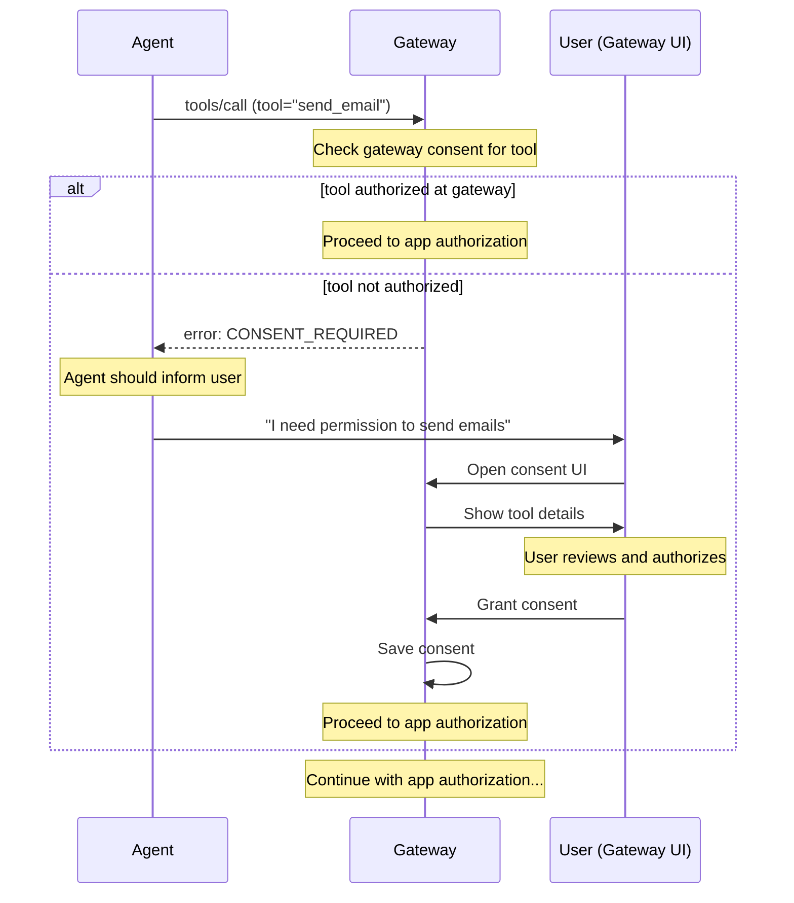
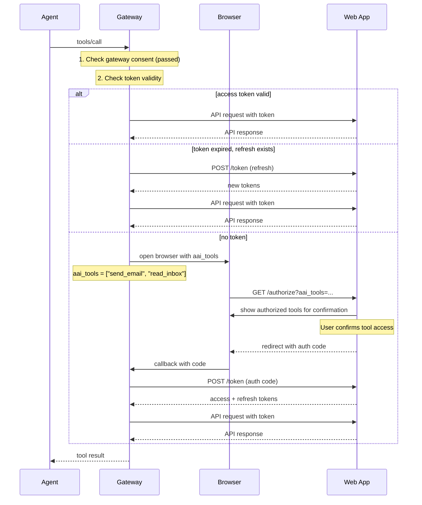

# Security Model

## Overview

Both authorization layers are about **user authorizing agent to access an app**, but with different protection goals:

| Layer | Initiated By | Protects Against |
|-------|--------------|------------------|
| **Gateway Consent** | Gateway | Malicious apps exposing dangerous tools to user |
| **App Authorization** | App or OS | Agent accessing app data without user's knowledge |

**Gateway Consent is required for ALL platforms** (macOS, web, linux, windows).

## Why Two Layers?

### Gateway Consent (Protects User from Malicious Apps)

Without Gateway consent:
- Malicious web app could expose `delete_all_files` tool
- Agent would call it without user awareness
- User's data destroyed

With Gateway consent:
- Gateway shows: "App X wants to expose tool: `delete_all_files`"
- Description: "Delete all files in user's home directory"
- User must explicitly authorize before agent can call

### App Authorization (Protects App Data from Unauthorized Agent Access)

Without App authorization:
- Agent could access user's email without app's knowledge
- User might not realize agent has full access to their data

With App authorization:
- Web app shows: "Agent X requests access to: send_email, read_inbox"
- User confirms they trust this agent
- App knows which operations are authorized

## Gateway Consent Flow



### Consent Required Error

When agent calls an unauthorized tool:

```json
{
  "error": {
    "code": "CONSENT_REQUIRED",
    "message": "User consent required for tool",
    "data": {
      "app_id": "com.example.mail",
      "app_name": "Example Mail",
      "tool": "send_email",
      "tool_description": "Send an email on behalf of the user",
      "tool_parameters": {
        "to": { "type": "array", "items": { "type": "string" }, "description": "Recipient email addresses" },
        "subject": { "type": "string", "description": "Email subject line" },
        "body": { "type": "string", "description": "Email body content" }
      },
      "consent_url": "aai://consent?app=com.example.mail&tool=send_email"
    }
  }
}
```

Agent should present this information to user and guide them to authorize.

## Gateway Consent UI Requirements

Gateway MUST display the following information:

### Required Information

| Field | Source | Description |
|-------|--------|-------------|
| App Name | `app.name` | Which app is exposing this tool |
| App ID | `app.id` | Unique identifier |
| Tool Name | `tool.name` | Tool identifier |
| Tool Description | `tool.description` | What the tool does |
| Parameters | `tool.parameters` | What data agent can pass to tool |
| Returns | `tool.returns` | What data tool returns (if sensitive) |

### UI Example

```
┌─────────────────────────────────────────────────────────────┐
│ ⚠️  Tool Authorization Request                              │
├─────────────────────────────────────────────────────────────┤
│                                                             │
│ App: Example Mail (com.example.mail)                        │
│                                                             │
│ Agent requests permission to use:                           │
│                                                             │
│ ┌─────────────────────────────────────────────────────────┐ │
│ │ send_email                                              │ │
│ │                                                         │ │
│ │ Send an email on behalf of the user                     │ │
│ │                                                         │ │
│ │ Parameters:                                             │ │
│ │ • to: Recipient email addresses                         │ │
│ │ • subject: Email subject line                           │ │
│ │ • body: Email body content                              │ │
│ │                                                         │ │
│ │ ⚠️ Agent can send emails to anyone with any content     │ │
│ └─────────────────────────────────────────────────────────┘ │
│                                                             │
│ [Authorize Tool]  [Authorize All Tools]  [Deny]             │
│                                                             │
│ ☐ Remember this decision                                   │
│                                                             │
└─────────────────────────────────────────────────────────────┘
```

### User Choices

| Option | Behavior |
|--------|----------|
| **Authorize Tool** | Grant access to this specific tool only |
| **Authorize All Tools** | Grant access to all tools from this app |
| **Deny** | Reject access, agent cannot use this tool |
| **Remember** | Persist decision, don't ask again for this tool |

## Secure Storage

**CRITICAL**: All sensitive data must be stored securely using OS-provided credential storage. Never store tokens or consent data in plaintext.

### Platform Storage APIs

| Platform | API | Description |
|----------|-----|-------------|
| macOS | Keychain Services | `SecItemAdd`, `SecItemCopyMatching` |
| Windows | Credential Manager | `CredWrite`, `CredRead` |
| Linux | libsecret / gnome-keyring | `secret_password_store`, `secret_password_lookup` |

### What to Store Securely

| Data Type | Storage Method | Why |
|-----------|----------------|-----|
| OAuth tokens | Encrypted in OS keystore | Sensitive credentials |
| Refresh tokens | Encrypted in OS keystore | Long-lived credential |
| Consent decisions | Encrypted in OS keystore | User authorization state |

### Data Format

Data stored in keystore should be JSON-encoded then encrypted:

```json
{
  "consents": {
    "com.example.mail": {
      "all_tools": false,
      "tools": {
        "send_email": {
          "granted": true,
          "granted_at": "2026-02-19T10:00:00Z",
          "remember": true
        },
        "delete_email": {
          "granted": false,
          "granted_at": "2026-02-19T10:00:00Z",
          "remember": true
        }
      }
    }
  }
}
```

### Storage Fields

| Field | Type | Description |
|-------|------|-------------|
| `all_tools` | boolean | User authorized all tools from this app |
| `tools.<name>.granted` | boolean | Whether this tool is authorized |
| `tools.<name>.granted_at` | string | When consent was granted |
| `tools.<name>.remember` | boolean | Persist decision |

### Implementation Example (macOS)

```swift
import Security

func storeConsent(_ consent: Data, forAppId appId: String) throws {
    let query: [String: Any] = [
        kSecClass as String: kSecClassGenericPassword,
        kSecAttrService as String: "aai-gateway",
        kSecAttrAccount as String: "consent-\(appId)",
        kSecValueData as String: consent
    ]
    
    let status = SecItemAdd(query as CFDictionary, nil)
    guard status == errSecSuccess else {
        throw KeychainError.storeFailed
    }
}

func loadConsent(forAppId appId: String) throws -> Data? {
    let query: [String: Any] = [
        kSecClass as String: kSecClassGenericPassword,
        kSecAttrService as String: "aai-gateway",
        kSecAttrAccount as String: "consent-\(appId)",
        kSecReturnData as String: true
    ]
    
    var result: AnyObject?
    let status = SecItemCopyMatching(query as CFDictionary, &result)
    
    if status == errSecItemNotFound {
        return nil
    }
    guard status == errSecSuccess else {
        throw KeychainError.loadFailed
    }
    
    return result as? Data
}
```

## App Authorization

After Gateway consent, the app (or OS) requires its own authorization. This protects app data from unauthorized agent access.

### Desktop (macOS)

| Layer | Protects |
|-------|----------|
| Gateway Consent | User from malicious apps |
| OS Authorization | App data from unauthorized agents |

macOS prompts user when Gateway first calls the app via Apple Events. User approves once, OS remembers.

### Web (OAuth 2.1)

| Layer | Protects |
|-------|----------|
| Gateway Consent | User from malicious apps |
| App Authorization | App data from unauthorized agents |

**Key**: Gateway passes authorized tools to web app via `aai_tools` parameter. Web app displays this list for user confirmation—no need to implement its own tool-level consent.

#### Authorization Flow



#### Authorization Endpoint

**Request** (browser redirect):

| Parameter | Type | Description |
|-----------|------|-------------|
| `response_type` | string | `code` |
| `client_id` | string | Client identifier |
| `redirect_uri` | string | Callback URL |
| `scope` | string | Space-separated scopes |
| `state` | string | CSRF token |
| `code_challenge` | string | PKCE challenge |
| `code_challenge_method` | string | `S256` |
| `aai_tools` | string | Comma-separated list of tools user authorized at Gateway |

Example:
```
GET /authorize?
  response_type=code&
  client_id=aai-gateway&
  redirect_uri=http://localhost:3000/callback&
  scope=read%20write&
  state=xyz&
  code_challenge=...&
  code_challenge_method=S256&
  aai_tools=send_email,read_inbox,list_contacts
```

**Web App UI**: Display `aai_tools` as a list for user confirmation:

```
┌─────────────────────────────────────────────────────────────┐
│ Authorize AAI Gateway                                       │
├─────────────────────────────────────────────────────────────┤
│                                                             │
│ This agent has been authorized to use:                      │
│                                                             │
│ ✓ send_email - Send emails on your behalf                   │
│ ✓ read_inbox - Read your inbox                              │
│ ✓ list_contacts - Access your contact list                  │
│                                                             │
│ Do you want to allow this agent to access your account?     │
│                                                             │
│ [Allow]  [Deny]                                             │
│                                                             │
└─────────────────────────────────────────────────────────────┘
```

**Response** (redirect):

| Parameter | Type | Description |
|-----------|------|-------------|
| `code` | string | Authorization code |
| `state` | string | Must match request |

#### Token Endpoint

**Request (authorization code)**:

```http
POST /oauth/token
Content-Type: application/x-www-form-urlencoded

grant_type=authorization_code&
code=<code>&
redirect_uri=<uri>&
code_verifier=<verifier>
```

**Request (refresh token)**:

```http
POST /oauth/token
Content-Type: application/x-www-form-urlencoded

grant_type=refresh_token&
refresh_token=<refresh_token>
```

**Response**:

```json
{
  "access_token": "eyJhbG...",
  "token_type": "Bearer",
  "expires_in": 3600,
  "refresh_token": "dGhpcyBpcy...",
  "scope": "read write"
}
```

| Field | Type | Description |
|-------|------|-------------|
| `access_token` | string | Token for API calls |
| `token_type` | string | `Bearer` |
| `expires_in` | number | Token lifetime in seconds |
| `refresh_token` | string | Token for refresh |

### Token Storage

Tokens MUST be stored securely using OS keystore:

| Platform | Storage Location |
|----------|------------------|
| macOS | Keychain (Service: `aai-gateway`, Account: `token-<app_id>`) |
| Windows | Credential Manager (Target: `aai-gateway/token/<app_id>`) |
| Linux | libsecret (Schema: `aai-gateway`, Attribute: `app_id`) |

**Data Format** (stored encrypted):

```json
{
  "access_token": "...",
  "refresh_token": "...",
  "expires_at": 1700000000,
  "token_type": "Bearer"
}
```

**NEVER**:
- Store tokens in plaintext files
- Log tokens to console or files
- Transmit tokens over unencrypted connections

### Token Lifetime Recommendations

| Token Type | Recommended |
|------------|-------------|
| Access Token | 1 hour |
| Refresh Token | 7 days |

---

[Back to Spec Index](./README.md)
